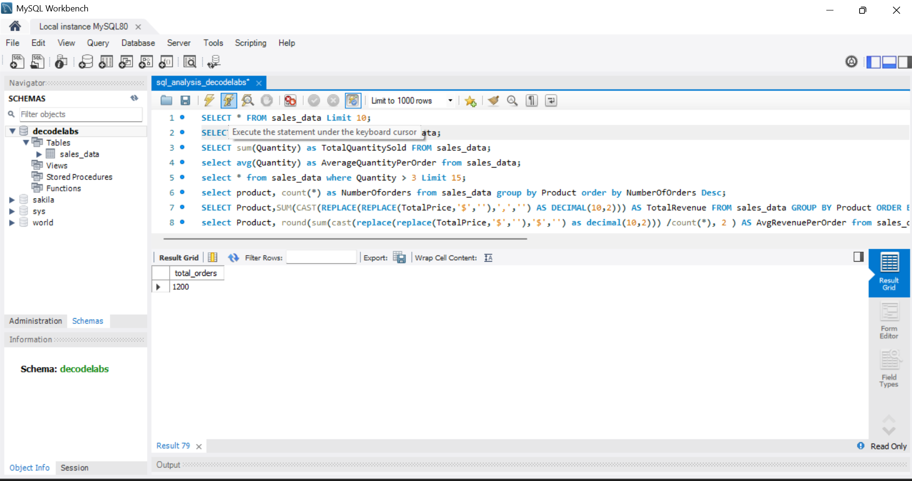
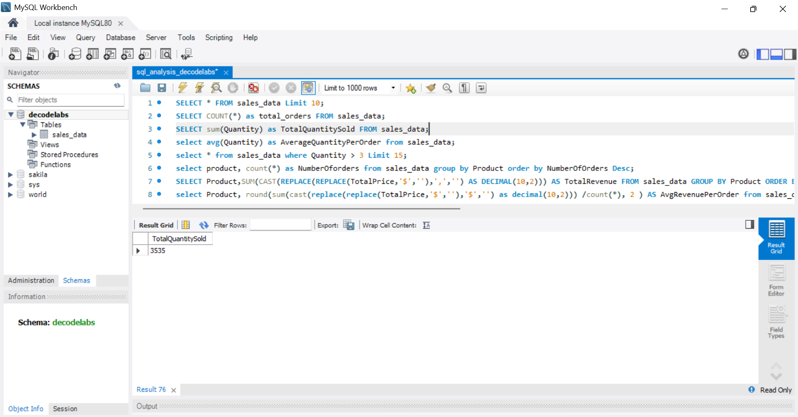
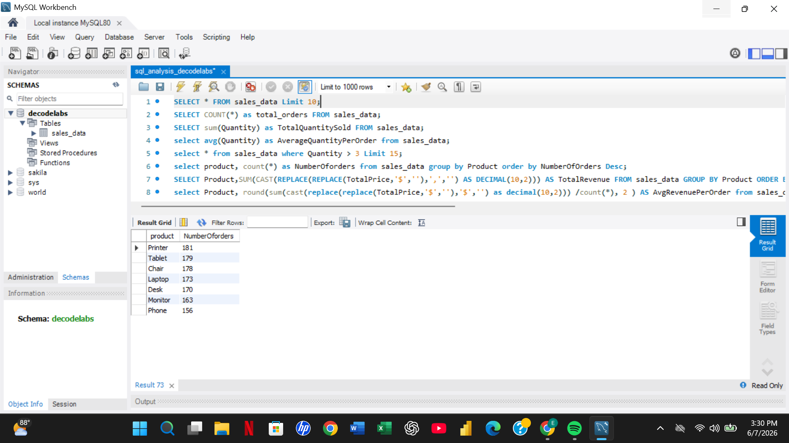
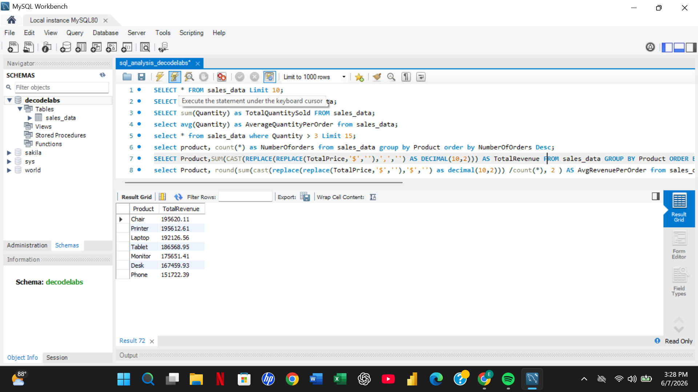
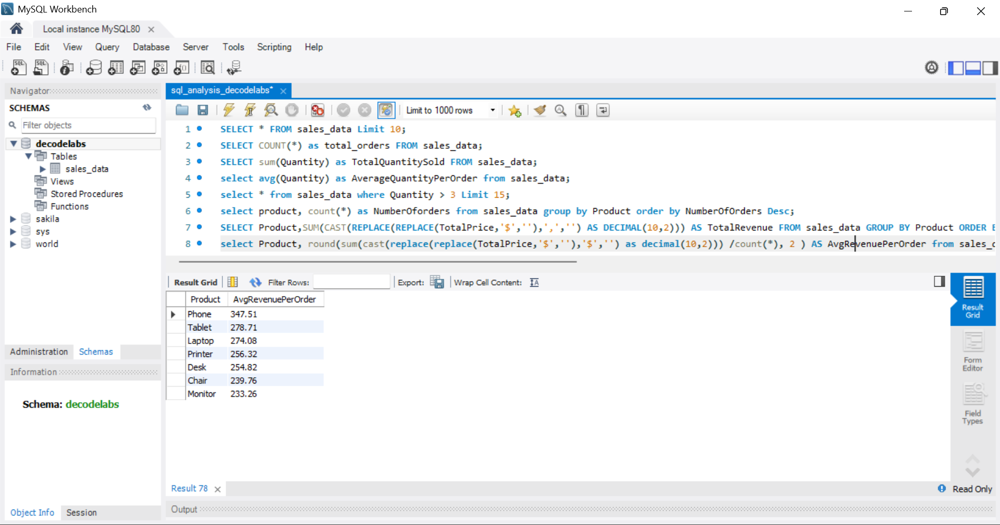

# decodelabs_sql_analysis_project
## Project overview
This project focuses on using SQL to analyze an e-commerce transaction dataset and extract meaningful business insights. The objective was to demonstrate the use of fundamental SQL concepts such as SELECT, WHERE, ORDER BY, GROUP BY, and aggregate functions to answer business questions and support decision-making.
The analysis was performed using MySQL Workbench.

## Dataset Description
The dataset contains 1,200 e-commerce transaction records and includes information on:
- OrderID
- Date
- CustomerID
- Product
- Quantity
- UnitPrice
- PaymentMethod
- OrderStatus
- CouponCode
- ReferralSource
- TotalPrice

## Analysis Objective
The analysis aimed to answer the following business questions:

- How many transactions were recorded?
- Which products generated the most revenue?
- Which products were purchased most frequently?
- Which payment methods were preferred by customers?
- Which coupon campaigns performed best?
- Which referral channels generated the highest revenue?
- How were transactions distributed across order statuses?

## SQL Concepts Demonstrate
The following SQL concepts were applied during the analysis:

-SELECT
-WHERE
-ORDER BY
-GROUP BY
-COUNT()
-SUM()
-AVG()
- Aggregate Functions
- Data Filtering
- Data Sorting

---

## Business Questions Answered

### 1. View Sample Records

```sql
SELECT * 
FROM sales_data
LIMIT 10;
```

### 2. How many orders were recorded?

```sql
SELECT COUNT(*) AS total_orders
FROM sales_data;
```

### 3. What quantity of products was sold?

```sql
SELECT SUM(Quantity) AS TotalQuantitySold
FROM sales_data;
```

### 4. What is the average quantity purchased per order?

```sql
SELECT AVG(Quantity) AS AverageQuantityPerOrder
FROM sales_data;
```

### 5. Which transactions involved more than three items?

```sql
SELECT *
FROM sales_data
WHERE Quantity > 3
LIMIT 15;
```

### 6. Which products received the highest number of orders?

```sql
SELECT Product,
       COUNT(*) AS NumberOfOrders
FROM sales_data
GROUP BY Product
ORDER BY NumberOfOrders DESC;
```

### 7. Which products generated the highest revenue?

```sql
SELECT Product,
       SUM(CAST(REPLACE(REPLACE(TotalPrice,'$',''),',','') AS DECIMAL(10,2))) AS TotalRevenue
FROM sales_data
GROUP BY Product
ORDER BY TotalRevenue DESC;
```

### 8. Which products generated the highest average revenue per order?

```sql
SELECT Product,
       ROUND(
           SUM(CAST(REPLACE(REPLACE(TotalPrice,'$',''),',','') AS DECIMAL(10,2))) / COUNT(*),
           2
       ) AS AvgRevenuePerOrder
FROM sales_data
GROUP BY Product
ORDER BY AvgRevenuePerOrder DESC;
```

## Analysis Outputs

### Total Orders Analysis



**Insight:**
- The dataset contains 1,200 customer transactions.

---

### Quantity Sold Analysis



**Insight:**
- A total of 3,550 units were sold across all product categories.

---

### Product Orders Analysis



**Insight:**
- Printers recorded the highest number of orders (181).
- Phones recorded the lowest number of orders (156).

---

### Revenue Analysis



**Insight:**
- Chairs generated the highest total revenue.
- Printers followed closely behind in revenue contribution.

---

### Average Revenue Per Order Analysis



**Insight:**
- Products with higher average revenue per order contributed more value per transaction.
- This metric helps identify premium-performing products.

---

## Project Files

- [SQL analysis decodelabs](SQL_analysis_decodelabs.sql)

---

## Tools Used

- MySQL Workbench
- SQL
- Microsoft Excel

---

## Recommendations

- Increase promotional efforts for high-performing products such as Chairs and Printers.

- Continue leveraging Instagram as a primary marketing channel.

- Optimize and expand the FREESHIP campaign.

- Investigate the causes of Cancelled orders.

- Monitor product-level sales performance regularly.

- Allocate marketing resources based on referral source performance.

---

## Conclusion

This project demonstrates the practical application of SQL for business analysis. By leveraging filtering, sorting, grouping, and aggregation functions, valuable insights were extracted from transactional data to support data-driven decision-making.

The findings highlight how SQL can be used to uncover trends, evaluate business performance, and generate actionable insights from raw transactional data.


